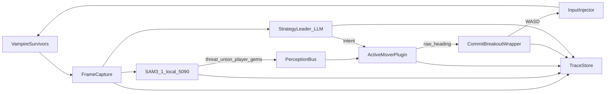
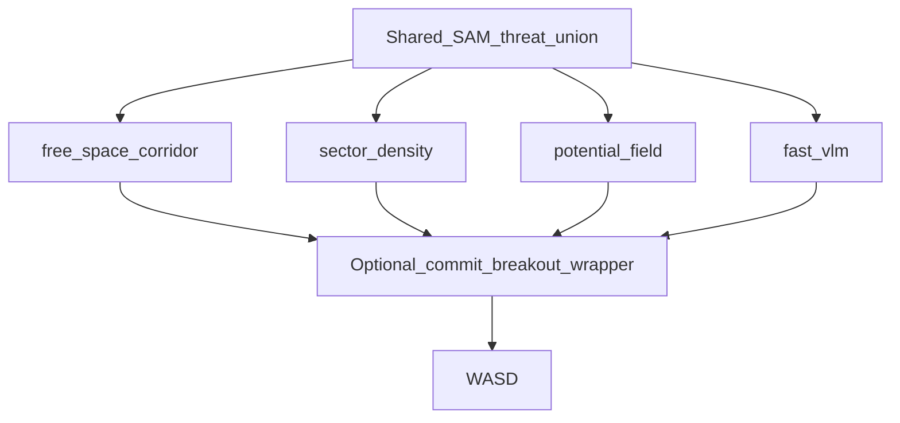
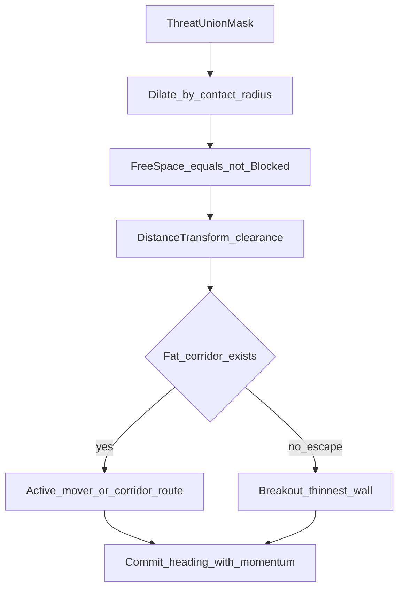
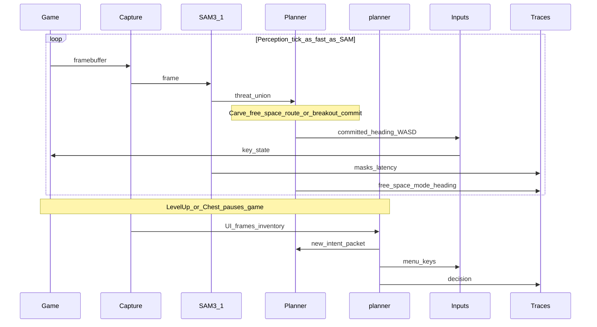
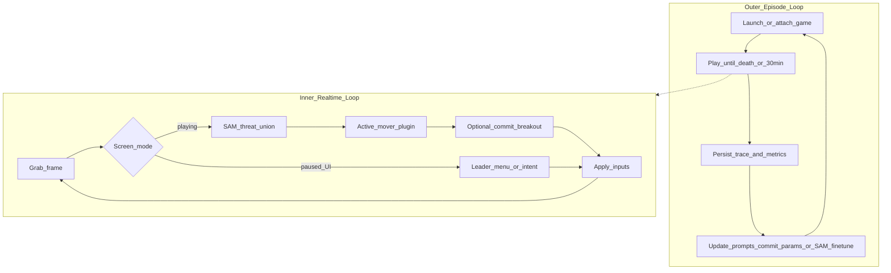

---
todos:
  - id: confirm-host
    status: completed
    content: Confirm game host on the RTX 5090 machine (windowed Steam) and OpenAI-compatible planner endpoint
  - id: sam-perception
    status: completed
    content: Wire local SAM 3.1 concept segmentation to enemy/player (and optional gem) masks; benchmark FPS on 5090
  - id: planner-plugins
    status: completed
    content: 'Implement pluggable movers (free-space corridor, sector density, potential field, fast-VLM) behind one interface'
  - id: commit-breakout
    status: completed
    content: Shared commit/momentum + breakout fallback usable by any mover; tune via traces
  - id: bakeoff
    status: completed
    content: Run comparative trials; log approach_id + survive time / deaths; keep winners without deleting losers
  - id: scaffold-harness
    status: completed
    content: Scaffold capture → mode detect → SAM → active mover → input inject → trace writer
  - id: wire-planner
    status: completed
    content: 'Wire event-driven planner for level-up/chest + slow intent packets (mode, attractors, build plan)'
  - id: trace-critique
    status: completed
    content: 'Define trace schema including approach_id, masks, commit/breakout events, outcomes'
name: VS Agent Harness
overview: 'Live Vampire Survivors harness with local SAM 3.1 threat-union perception, a pluggable movement stack (multiple routing/control approaches under A/B test—we do not assume one optimum), a slow OpenAI-compatible strategy planner, and traces that score which approach survives.'
isProject: false
---
# Vampire Survivors planner–pilot Agent Harness

## What Vampire Survivors actually is (for agents)

Vampire Survivors is a survivors-like: you move a character; **weapons fire automatically**. Enemies swarm; XP gems drop; level-ups **pause** the game and offer weapon/passive choices. Builds evolve via weapon+passive+chest rules. A run lasts up to ~30 minutes before the Reaper.

That splits cleanly into three control problems:

| Timescale | Game task | Agent job |
|---|---|---|
| Very fast (math / input rate) | Hold a steering direction | Curve pilot → WASD |
| Fast perception (local GPU) | Where are threats / me / maybe gems | SAM 3.1 masks → costmap |
| Discrete / paused | Level-up, chests, Arcana, evolve plan | Slow planner LLM → choice + intent |
| Episodic | Whole run quality | Traces for later improvement |

You do **not** need aim or attack buttons. Moment-to-moment survival is mostly **geometry under clutter**; builds are **paused discrete decisions**.

---

## SAM 3.1 — what it is and why it fits

Yes — **SAM 3.1** is real. Meta released **SAM 3** (Nov 2025): promptable *concept* segmentation — text/exemplar prompts return **all matching instances** as masks (image + video). **SAM 3.1** (Mar 27, 2026) is a drop-in speed update focused on video: **Object Multiplex** tracks many objects in shared forward passes (~2× medium-count throughput, ~7× at 128 objects on H100; Meta cites ~16→32 FPS medium-count on one H100). Code: [facebookresearch/sam3](https://github.com/facebookresearch/sam3) (11.1k stars); checkpoints: `facebook/sam3.1` on Hugging Face.

For Vampire Survivors we want **shapes, not identities**:

- **No track IDs.** Prompt concepts / exemplars → instance masks → **union** into one **threat blob field**.
- Carve the complement: **free space** = playable area minus dilated threat.
- Separate prompt / center prior for **player**; optional gems/chests as attractors only.
- SAM 3 image path claims ~**30 ms** for 100+ objects on H200; local **RTX 5090** is the host. Multiplex tracking is irrelevant to the default design—we discard IDs immediately.

Faster-than-SAM fallbacks later if needed: tiny detector, color heuristics, motion differencing.

---

## Revised architecture: shared perception, pluggable movers

We do **not** claim one movement algorithm is optimal. The harness shares perception + input + traces, and swaps **mover plugins** under experiment configs.

Shared spine:

1. **SAM** → enemy **union** mask (+ player); **no track IDs**  
2. **Active mover plugin** → proposed heading (from free-space route, sectors, potential field, or slow VLM, etc.)  
3. **Shared commit / breakout wrapper** (optional per trial) → sticky WASD, momentum, power-through when boxed  
4. **planner** → builds + intent bias for whichever mover is active  

### Local perception (SAM 3.1 on RTX 5090) — shared

- Run [`facebookresearch/sam3`](https://github.com/facebookresearch/sam3) with SAM 3.1 checkpoints locally.
- Per-frame (or every N frames) → **union threat mask**; discard instance IDs.
- Publish on a perception bus: `threat_union`, `player_mask`, optional attractors, timestamps, `inference_ms`.
- Perception variants can also be A/B’d later (exemplar vs text prompt, crop size, every-frame vs every-2nd).

### Candidate mover approaches (test, don’t presuppose winner)

All expose the same interface: `propose(perception, intent, state) -> heading (+ debug)`.

1. **`free_space_corridor`** (strong prior, not crowned)  
   Carve free space from dilated threat; distance transform; short-horizon route along fat corridors; goals from planner intent.

2. **`sector_density`**  
   Polar histogram of threat in N sectors; pick lowest-cost sector with clearance / gem / orbit terms. Cheaper, more myopic.

3. **`potential_field`**  
   Repulsors from threat pixels (or blurred threat), attractors from gems/intent; follow negative gradient. Good baseline for “feel.”

4. **`fast_vlm`**  
   OpenAI-compatible small VLM ~2 Hz proposing 8-way move from frames + intent. Likely slower/weaker for pure dodge; keep as control / hybrid (VLM only sets bias).

5. **Hybrids** (second wave)  
   e.g. free-space route for survival + VLM/planner bias for farming; or sector proposal with free-space veto.

Bakeoff protocol:

- Config selects `approach_id` (+ wrapper on/off, `T_commit`, breakout params).
- Fixed character/stage/seed policy when the game allows; otherwise compare distributions over many runs.
- Primary metrics: survive time, time-to-first-hit, gem rate, breakout count, heading entropy, SAM latency.
- Keep losing approaches in-tree; winners get more tuning, not exclusive ownership of the harness.

### Shared commit / momentum / breakout wrapper

Vampire Survivors punishes hesitation. These behaviors are a **wrapper** we can enable/disable and tune across movers:

1. **Commit window** — hold chosen heading for `T_commit` (separate values for route vs breakout).
2. **Momentum bias** — penalize large reversals unless clearance gain is large.
3. **Breakout fallback** — if free space / clearance under threshold (or mover signals `trapped`): pick thinnest wall to freer space, power through, longer commit, kill gem attraction.
4. **Stuck detector** — little motion while surrounded → force breakout.
5. Log `wrapper_mode`: `passthrough | committed | breakout` so we learn whether the wrapper helps each mover.

Free-space carving diagram (for approach 1 + for breakout geometry even when another mover proposes):

### Slow planner (OpenAI-compatible)

- Level-up / chest / Arcana when UI pauses; periodic intent refresh.
- Intent feeds the **active mover**:
  - `mode`, `attractors`, `orbit`, `build_plan`, `levelup_policy`.
- planner never micromanages WASD.

---

## What “the loop” means (still the right pattern)

This is still **live attach → sense → act → record**, not “train a Gym policy first.”

1. Harness launches / focuses Vampire Survivors (windowed) on the 5090 machine.
2. Capture framebuffer with timestamps.
3. Mode detect: `playing | levelup | chest | pause | dead | title`.
4. If playing: SAM masks → costmap → curve → keys; log everything.
5. If paused UI: planner chooses; inject menu keys; update intent.
6. On death / 30:00: archive run trace; critique / prompt / few-shot improve; relaunch.

“Train” = expose traces of play (frames, masks, costmaps, actions, intents, outcomes) and improve the stack from that tape.

---

## Nested loops

---

## Step-by-step build order

1. **Host**: Windowed VS on the RTX 5090 box; reliable focus + capture.
2. **Mode classifier**: Cheap CV/OCR so SAM/planner never fight pause menus.
3. **SAM 3.1 perception**: Union threat mask + player; no IDs kept; sanity-check overlays.
4. **Mover plugin interface** + first two implementations (`free_space_corridor`, `sector_density`); debug overlay.
5. **Commit/breakout wrapper** as toggleable layer; same overlay shows commit state.
6. **Input bridge**: Held WASD + menu keys + kill-switch.
7. **planner**: OpenAI-compatible endpoint for paused decisions + intent packets.
8. **Bakeoff harness**: run configs by `approach_id`; aggregate survive-time / entropy / breakouts.
9. **Add** `potential_field` and `fast_vlm` once the spine is stable; iterate winners without deleting losers.
10. **Improve**: tune from traces; optional SAM fine-tune if masks are the bottleneck.

---

## Pain points (bakeoff-aware)

1. **Concept vocabulary mismatch** — zero-shot SAM may miss VS sprites; exemplars / fine-tune.
2. **Union mask quality under FX** — fake walls/holes hurt free-space and breakout geometry for every mover that uses the mask.
3. **Confounded bakeoffs** — different builds/luck swamp mover differences; need many runs + log planner choices / luck proxies.
4. **Gems vs monsters** — attractor weight is itself a hyperparam under test.
5. **Player localization / stale masks / map edges** — shared perception bugs punish all approaches equally (fix early).
6. **Commit vs adaptability** — wrapper may help one mover and hurt another; always test wrapper on/off.
7. **Breakout wall choice** — thickness × clearance-beyond × edge penalty; tune from traces.
8. **Mode detection / planner builds** — still load-bearing outside the mover bakeoff.
9. **GPU + trace bulk** — tag every episode with `approach_id`; store RLE masks + headings, not IDs.

---

## Starting config (not “the answer”)

- **Perception**: local SAM 3.1 → threat union + player; no IDs.
- **First bakeoff slate**: `free_space_corridor` vs `sector_density`, each × wrapper `{off, on}`.
- **Wrapper priors to try** (not frozen): `T_commit` ~150–300 ms route, longer breakout; no gems in breakout.
- **Then add**: `potential_field`, `fast_vlm` (control/hybrid).
- **planner**: OpenAI-compatible model on pause + ~15 s intent refresh.
- **Traces always carry `approach_id`** so winners are empirical.

---

## What we’re *not* assuming

- Not: one true routing algorithm.
- Not: track IDs.
- Not: planner issuing WASD every tick.
- Not: that commit/breakout always helps (wrapper is under test).
- Yes: **shared SAM threat-union spine + multiple movers under experiment + slow planner + traces that pick winners empirically**.

